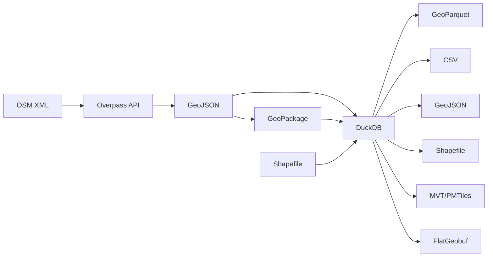

# Introduction to Geospatial Data Analysis


> [!CAUTION]
> **License and Attribution Notice**
>
> The data used in this repository is subject to the following licenses:
> - **OpenStreetMap Data**: [ODbL (Open Database License)](https://www.openstreetmap.org/copyright)
>   - © OpenStreetMap contributors
> - **PLATEAU Data**: [CC BY 4.0](https://creativecommons.org/licenses/by/4.0/deed.en)
>   - Source: Ministry of Land, Infrastructure, Transport and Tourism PLATEAU
>
> When reusing data, please follow these license conditions and provide appropriate attribution.

A practical educational resource for learning geospatial data analysis with DuckDB from the ground up. Using real data from Kyoto City (23,111 POIs), you can learn practical geospatial analysis methods from tourism analysis to trade area analysis.

## Table of Contents

- [Features](#features)
- [Quick Start](#quick-start)
- [Technology Stack](#technology-stack)
- [Dataset](#dataset)
- [Learning Content](#learning-content)
  - [Chapter 1: Geospatial Data Standards](#chapter-1-geospatial-data-standards)
  - [Chapter 2: Geospatial Data Fundamentals](#chapter-2-geospatial-data-fundamentals)
  - [Chapter 3: DuckDB Spatial Extension](#chapter-3-duckdb-spatial-extension)
- [References](#references)

## Features

- **Learn with Real Data**: 23,111 actual POI data points from Kyoto City
- **Runs in Browser**: No installation required, try it immediately
- **Standards Compliant**: Covers industry standards including OGC, GeoJSON, and H3

## Quick Start

```bash
# Start local server
python3 -m http.server 8000

# Access in browser
# http://localhost:8000/docs/
```

## Technology Stack

- **DuckDB WASM**: SQL database running in browser
- **DuckDB Spatial Extension**: Geospatial analysis capabilities
- **DuckDB H3 Extension**: H3 hexagonal grid system
- **MapLibre GL JS**: Open-source map rendering library
- **GeoJSON**: Geospatial data format

## Dataset

Real data from Kyoto City obtained from OpenStreetMap and PLATEAU (September 2025):

| Category | Data Count | Attribute Types | File |
|---------|--------:|--------:|---------|
| **Tourist Sites & Temples** | 12,493 | 317 | `data/kyoto/tourism_temples.geojson` |
| **Accommodation** | 630 | 127 | `data/kyoto/accommodation.geojson` |
| **Restaurants** | 4,131 | 255 | `data/kyoto/restaurants.geojson` |
| **Public Transport** | 2,626 | 98 | `data/kyoto/transport.geojson` |
| **Convenience Stores** | 650 | 95 | `data/kyoto/convenience_stores.geojson` |
| **Supermarkets** | 268 | 72 | `data/kyoto/supermarkets.geojson` |
| **Souvenir Shops** | 432 | 67 | `data/kyoto/souvenir_shops.geojson` |
| **Parks & Gardens** | 1,881 | 113 | `data/kyoto/parks_gardens.geojson` |

**Total: 23,111 POI data points**

## Learning Content

## Chapter 1: Geospatial Data Standards

When working with geospatial data, we often share data between different systems and combine various tools for analysis. For example, analyzing data obtained from OpenStreetMap with DuckDB and displaying the results on a web browser map. International standards enable this kind of interoperability.

### 1.1 Why Standards Matter

Let's consider Kyoto's tourism data as an example. When expressing the location of Kiyomizu-dera Temple as "34.995, 135.785" in latitude and longitude, without clarity on whether this order is "latitude-longitude" or "longitude-latitude", we could be pointing to completely different places. In fact, GeoJSON requires longitude first, while typical map applications often display latitude first, and this difference causes confusion.

#### Role of OGC (Open Geospatial Consortium) Standards

OGC establishes international standards for geospatial data to prevent such confusion. Let's look at major standards and their practical applications:

| Standard | Description | Practical Use Case |
|------|------|-------------|
| **Simple Features** | Basic geometry specification | Express Kiyomizu Temple as a "point", approach path as a "line", and grounds as a "polygon" uniformly |
| **WKT/WKB** | Well-Known Text/Binary | Store in database as text format like `POINT(135.785 34.995)` |
| **WFS** | Web Feature Service | Retrieve latest tourist site data from Kyoto City API |
| **WMS** | Web Map Service | Overlay topographic maps and aerial photos as layers |
| **WMTS** | Web Map Tile Service | Deliver zoomable map tiles like Google Maps |

#### GeoJSON Specification (RFC 7946) - Common Language for Sharing Geographic Data on the Web

GeoJSON is the most developer-friendly geospatial data format for web developers. This is because it can be handled directly as JavaScript objects, allowing creation of map applications without special libraries.

Let's understand GeoJSON structure using actual temple data from Kyoto:

```json
{
  "type": "FeatureCollection",  // Collection of multiple features
  "features": [{
    "type": "Feature",           // Individual feature (location)
    "geometry": {
      "type": "Point",
      "coordinates": [135.785, 34.995]  // Important: Always [longitude, latitude] order
    },
    "properties": {              // Freely add attribute information for this location
      "name": "Kiyomizu Temple",
      "visitors_per_year": 5000000,
      "unesco_site": true
    },
    "id": "kiyomizu-dera"       // ID for database integration
  }]
}
```

**Why longitude first?** This follows the mathematical coordinate system (x, y) order. However, in daily conversation we often say "latitude ○°N, longitude ○°E" with latitude first, making this difference the most common mistake for beginners.

### 1.2 Coordinate Reference Systems (CRS) and EPSG Codes

The Earth is a sphere, but the maps and displays we work with are flat. The method of converting from 3D to 2D is called a "coordinate reference system," which must be chosen according to purpose. EPSG codes are globally unique identifiers assigned to these coordinate systems.

#### Why Multiple Coordinate Systems Are Necessary

Consider searching for restaurants within 500 meters in Kyoto. With WGS84 (latitude/longitude), you need non-intuitive calculations like "within 0.0045 degrees." Converting to a metric coordinate system allows simple calculations like "within 500 meters."

| EPSG Code | Name | When to Use | Example |
|-----------|------|-----------|------|
| **4326** | WGS84 | Storing GPS data, global analysis | Smartphone location, satellite data |
| **3857** | Web Mercator | Web map display | Google Maps, OpenStreetMap tile display |
| **6668** | JGD2011 | Accurate surveying in Japan | Geospatial Information Authority maps, earthquake observation |
| **2443-2461** | Japan Plane Rectangular | Urban planning, architectural drawings | Kyoto uses Zone 6 (EPSG:2448) |

**Practical Tip:** Perform analysis in metric systems (3857 or plane rectangular), and save/share in WGS84.

### 1.3 OpenStreetMap Tag Specification

OpenStreetMap is a map database created by volunteers worldwide. To uniformly describe features across different cultures and languages, it adopts a flexible "Key=Value" tag system.

#### Why a Tag System?

Consider Kiyomizu Temple. It's a "temple," a "tourist site," and a "World Heritage site." This multifaceted nature, which cannot be expressed with fixed categories, can be represented by combining multiple tags:

```yaml
# Actual tags for Kiyomizu Temple
name: 清水寺
name:en: Kiyomizu-dera Temple
tourism: attraction      # As a tourist site
amenity: place_of_worship  # As a place of worship
religion: buddhist       # As a Buddhist facility
heritage: yes           # As cultural heritage
```

#### Important Tag Categories for Kyoto Data Analysis

```yaml
tourism:           # Tourism-related facilities
  attraction      # Kiyomizu Temple, Kinkaku-ji, etc. (general tourist sites)
  museum          # Kyoto National Museum, etc.
  viewpoint       # Kiyomizu Stage, Shogunzuka, etc. (viewing spots)

amenity:          # Convenience facilities
  place_of_worship  # Temple/shrine worship function
  restaurant      # Traditional restaurants, restaurants
  cafe           # Machiya cafes, tea houses

shop:            # Commercial facilities
  convenience    # 7-Eleven, Lawson, etc.
  gift          # Yatsuhashi, fans, and other souvenir shops

historic:        # Historical value
  castle        # Nijo Castle
  shrine        # Fushimi Inari (Japan-specific extension)
```

**Data Collection Tip:** Since facilities often have multiple tags, OR searches can create duplicates. The data in this tutorial is pre-organized by major tags.

### 1.4 Overpass API

Overpass API is a query API for efficiently retrieving only the necessary regional and type-specific data from the massive OpenStreetMap database. It uses its own query language (Overpass QL), similar to SQL.

#### Learning Overpass QL through Examples

Let's understand a query to retrieve all temples in Kyoto City step by step:

```
[out:json][timeout:25];  // Output format and timeout settings
area["name"="Kyoto City"]->.kyoto;  // Store Kyoto City area in variable 'kyoto'
(
  node["amenity"="place_of_worship"]["religion"="buddhist"](area.kyoto);  // Point data for Buddhist temples
  way["amenity"="place_of_worship"]["religion"="buddhist"](area.kyoto);   // Building outlines of temples
  relation["amenity"="place_of_worship"]["religion"="buddhist"](area.kyoto); // Multi-building temple complexes
);
out body;  // Output with all attribute information
>;          // Also output all nodes composing ways
out skel qt; // Fast output with minimal information
```

**Why search for node, way, and relation?**
- **node**: Small shrines or Jizo statues represented as points
- **way**: Common temples with building outlines
- **relation**: Large temple complexes with multiple buildings like Higashi Honganji

Combining these three prevents missing data.

### 1.5 Cloud-Native Geospatial Formats

While traditional GeoJSON and Shapefiles are suitable for small-scale data, they have limitations when handling millions of POI data points or satellite imagery. This led to the emergence of new-generation formats optimized for large-scale processing in cloud environments.

#### Why GeoParquet is Getting Attention

Let's compare using Kyoto's 23,111 POI data points as an example:

| Format | File Size | Loading Speed | Features |
|------|--------------|------------|------|
| GeoJSON | 15MB | Must load entire file | Human-readable, easy to edit |
| GeoParquet | 3MB | Load only needed columns | 80% compression, 100x faster analysis |

GeoParquet enables partial data retrieval like "only names of restaurants near Kiyomizu Temple," significantly reducing network transfer and processing time.

```python
# Using GeoParquet with DuckDB
# Traditional: Load entire 15MB GeoJSON and process
SELECT name FROM ST_Read('kyoto.geojson')
WHERE tourism = 'attraction';

# Optimized: Load only needed columns, 3MB
SELECT name FROM 'kyoto.parquet'
WHERE tourism = 'attraction';  # 100x faster!
```

#### Format Selection Guide by Use Case

| Format | When to Use | Kyoto Data Application |
|-------------|----------|-----------------|
| **GeoParquet** | Large-scale analysis | Analyzing 1 million building records |
| **PMTiles** | Offline map delivery | Map data for tourism apps |
| **MVT** | Dynamic map display | Optimal display by zoom level |
| **FlatGeobuf** | Real-time processing | Location information streaming |
| **COG** | Satellite/aerial imagery | Land use change analysis |

### 1.6 Spatial Indexes

Consider searching for "cafes within 500m of Kiyomizu Temple." A naive approach would require calculating distances to all 4,131 restaurants. With spatial indexes, you can narrow candidates to dozens before distance calculation, achieving over 100x speedup.

#### Major Spatial Indexes and Their Applications

| Index | Provider | Best Use | Kyoto Application |
|-------------|--------|-----------|-------------|
| **H3** | Uber | Aggregation & visualization | Visualize tourist density with hexagonal grid (resolution 9 ~122m²) |
| **S2** | Google | Global-scale search | Calculate distances from Kyoto to worldwide locations |
| **Geohash** | - | Rough neighborhood filtering | "xn7" represents entire Kyoto City |
| **R-Tree** | - | Complex shape searches | Fast search for restaurants along Kamo River |

#### Practical H3 Example: Visualizing Tourist Distribution

```sql
-- Divide Kyoto Station area into resolution 9 hexagons (~122m²)
SELECT
  h3_cell_to_boundary_geometry(
    h3_latlng_to_cell(lat, lng, 9)
  ) as hexagon,
  COUNT(*) as poi_count
FROM restaurants
GROUP BY h3_latlng_to_cell(lat, lng, 9);
```

Why H3 uses hexagons:
1. **Equidistance**: All adjacent cells are equidistant from center
2. **Resolution flexibility**: Choose coarse/fine grids as needed
3. **Efficient aggregation**: Proven by Uber for ride dispatch optimization

### 1.7 Data Format Interconversion



## Chapter 2: Geospatial Data Fundamentals

### 2.1 Coordinate Systems and Geodetic Systems

When displaying "current location" in a smartphone map app, complex calculations are actually performed. GPS satellite signals are converted to latitude/longitude and then projected to pixel positions on the screen.

#### Practical Coordinate Knowledge Using Kyoto City

```python
# Geographic extent of Kyoto City
Longitude range: 135.575132 ~ 135.855818  # ~25.5km east-west
Latitude range: 34.882791 ~ 35.280339   # ~44.2km north-south
Center: (135.760, 35.012)        # Near Kyoto City Hall

# Distance calculation pitfalls
Latitude diff 0.01° = ~1.11km (constant everywhere)
Longitude diff 0.01° = ~0.91km (at Kyoto's latitude)
                    = ~1.11km (at equator)
                    = ~0km (at North Pole)
```

**Practical Problem:** When calculating straight-line distance from Kiyomizu Temple to Kinkaku-ji, using simple coordinate differences causes errors. This is because Earth is a sphere. Accurate distance calculation requires spherical trigonometry (Haversine formula).

```sql
-- Accurate distance calculation in DuckDB
SELECT
  ST_Distance_Spheroid(
    ST_Point(135.785, 34.995),  -- Kiyomizu Temple
    ST_Point(135.729, 35.039)   -- Kinkaku-ji
  ) as distance_meters;  -- Result: ~7,070m
```

### 2.2 GeoJSON Format

Why is GeoJSON widely used? Because web developers can create map applications without additional learning. It can be handled directly in JavaScript and is automatically displayed as a map on GitHub.

#### Understanding GeoJSON Structure with Actual Kyoto Data

Let's look at the role of each element using Kiyomizu Temple data as an example:

```json
{
  "type": "FeatureCollection",     // Data type (collection of features)
  "features": [
    {
      "type": "Feature",           // Single feature (location or area)
      "geometry": {                // Location information
        "type": "Point",
        "coordinates": [135.785, 34.995]  // ⚠️ [longitude, latitude] order!
      },
      "properties": {              // Attributes of the location (freely extensible)
        "name": "Kiyomizu Temple",
        "name:en": "Kiyomizu-dera",
        "tourism": "attraction",   // Tourism category
        "visitors": 5000000,       // Annual visitors
        "unesco": true,           // World Heritage Site
        "hours": "6:00-18:00"     // Visiting hours
      }
    }
  ]
}
```

### 2.3 Characteristics of Attribute Data

Location information alone only tells us "something is there." By combining attribute data, we can understand "what" exists, "when," and "with what characteristics," enabling advanced analysis.

#### What Kyoto's Multilingual Data Teaches Us

```python
# Why multilingual data is important
name: "清水寺"              # Display for Japanese
name:en: "Kiyomizu-dera"    # Apps for foreign tourists
name:ja-Latn: "Kiyomizu-dera" # For those who can't read kanji
name:zh: "清水寺"           # For Chinese-speaking tourists

# Use case: Automatic generation of language-specific tourist maps
SELECT
  COALESCE(properties->>'name:en', properties->>'name') as display_name,
  geometry
FROM tourism_temples
WHERE properties->>'tourism' = 'attraction';
```

#### Advanced Analysis Using Classification Tags

Kyoto's POI data has multiple tags, enabling analysis from various perspectives:

```sql
-- Example 1: Extract "experiential" tourist spots popular with foreigners
SELECT name,
       properties->>'name:en' as english_name
FROM tourism_temples
WHERE properties ? 'website'        -- Has website
  AND properties ? 'name:en'        -- Has English name
  AND properties->>'fee' != 'yes';  -- Free admission

-- Example 2: Analysis of famous tourist spots with Wikipedia articles
SELECT
  name,
  properties->>'wikidata' as wikidata_id,
  properties->>'wikipedia' as wikipedia
FROM tourism_temples
WHERE properties ? 'wikidata'       -- Used as indicator of fame
ORDER BY properties->>'visitors' DESC;
```

#### Practical Value of External References

- **Wikidata ID**: Automatically fetch multilingual descriptions and images
- **Wikipedia**: Integrate detailed historical information into apps
- **Website**: Check latest operating hours and fees

## Chapter 3: DuckDB Spatial Extension

### DuckDB Spatial's Strengths

While PostGIS and QGIS have traditionally been used for geospatial data analysis, DuckDB has unique strengths:

1. **Easy Installation**: No complex server setup, just `INSTALL spatial;`
2. **Fast**: Column-oriented database makes analytical queries 10-100x faster
3. **Familiar SQL**: Function set compatible with PostGIS
4. **Works Locally**: No cloud costs, data privacy protection

### 3.1 Learning DuckDB Spatial through Practical Examples

#### Use Case 1: Finding Cafes within 10-Minute Walk from Kiyomizu Temple

```sql
-- Practical query using actual Kyoto data
WITH kiyomizu AS (
  SELECT ST_Point(135.785, 34.995) as location
)
SELECT
  r.name,
  r.properties->>'cuisine' as cuisine_type,
  ST_Distance_Spheroid(r.geometry, k.location) as distance_meters
FROM
  restaurants r,
  kiyomizu k
WHERE
  r.properties->>'amenity' = 'cafe'
  AND ST_DWithin(r.geometry, k.location, 0.01)  -- Narrow down to ~1km radius
  AND ST_Distance_Spheroid(r.geometry, k.location) <= 800  -- Exactly within 800m
ORDER BY
  distance_meters;
```

#### Use Case 2: Visualizing Dense Tourist Areas

```sql
-- Calculate tourist site density with H3 grid
SELECT
  h3_cell_to_boundary_geometry(
    h3_latlng_to_cell(ST_Y(geometry), ST_X(geometry), 9)
  ) as hexagon,
  COUNT(*) as attraction_count,
  ARRAY_AGG(name ORDER BY properties->>'visitors' DESC) as top_attractions
FROM tourism_temples
WHERE properties->>'tourism' = 'attraction'
GROUP BY h3_latlng_to_cell(ST_Y(geometry), ST_X(geometry), 9)
HAVING COUNT(*) > 3  -- Only areas with 3+ attractions
ORDER BY attraction_count DESC;
```

### 3.2 PostGIS Compatibility

If you already know PostGIS, you can use the same function names (`ST_` prefix) as is:

```sql
-- These functions are fully compatible with PostGIS
ST_Point(lon, lat)              -- Create a point
ST_Distance(geom1, geom2)       -- Calculate distance
ST_Buffer(geom, radius)         -- Create buffer
ST_Within(point, polygon)       -- Containment check
ST_AsGeoJSON(geom)             -- GeoJSON output
```

### 3.3 Practical Use of Spatial Functions

#### Distance and Search Functions

```sql
-- Calculate distance from Kiyomizu Temple to each tourist site, display in order of proximity
WITH kiyomizu AS (
  SELECT ST_Point(135.785, 34.995) as loc
)
SELECT
  name,
  ROUND(ST_Distance_Spheroid(geometry, k.loc)) as meters,
  CASE
    WHEN ST_Distance_Spheroid(geometry, k.loc) < 500 THEN 'Within 5-min walk'
    WHEN ST_Distance_Spheroid(geometry, k.loc) < 1000 THEN 'Within 10-min walk'
    ELSE 'Transportation needed'
  END as accessibility
FROM tourism_temples t, kiyomizu k
WHERE name != 'Kiyomizu Temple'
ORDER BY meters
LIMIT 10;
```

#### Analysis and Aggregation Functions

```sql
-- Aggregate facility count by area (500m grid)
SELECT
  ROUND(ST_X(geometry) * 200) / 200 as grid_lon,
  ROUND(ST_Y(geometry) * 200) / 200 as grid_lat,
  COUNT(*) as facility_count,
  STRING_AGG(name, ', ') as facilities
FROM tourism_temples
GROUP BY grid_lon, grid_lat
HAVING COUNT(*) > 2
ORDER BY facility_count DESC;
```

## References

### Standard Specifications
1. [GeoJSON (RFC 7946)](https://datatracker.ietf.org/doc/html/rfc7946) - IETF GeoJSON Specification
2. [OGC Simple Features](https://www.ogc.org/standard/sfs/) - OGC Simple Features Specification
3. [GeoParquet Specification](https://github.com/opengeospatial/geoparquet) - Apache Parquet Geospatial Extension
4. [Mapbox Vector Tile Specification](https://github.com/mapbox/vector-tile-spec) - MVT Specification v2.1
5. [STAC Specification](https://stacspec.org/) - SpatioTemporal Asset Catalog
6. [H3 Specification](https://h3geo.org/docs) - Uber H3 Hexagonal Grid
7. [S2 Geometry](https://s2geometry.io/) - Google S2 Spherical Grid

### DuckDB & Spatial Analysis
8. [DuckDB Spatial Extension Official Documentation](https://duckdb.org/docs/extensions/spatial)
9. [PostGIS Function Reference](https://postgis.net/docs/reference.html) - Functions compatible with DuckDB
10. [Spatial queries in DuckDB with R-tree and H3 indexing](https://www.architecture-performance.fr/ap_blog/spatial-queries-in-duckdb-with-r-tree-and-h3-indexing/)

### Data Sources & API Specifications
11. [OpenStreetMap Wiki](https://wiki.openstreetmap.org/wiki/Map_features) - OSM Tag Specifications
12. [Overpass API Language Guide](https://wiki.openstreetmap.org/wiki/Overpass_API/Language_Guide) - Overpass QL Specifications
13. [EPSG.io](https://epsg.io/) - EPSG Coordinate System Database
14. [G-Spatial Information Center](https://front.geospatial.jp/) - Japan's Geospatial Information Platform

### Implementation Examples & Applications
15. [Geospatial Analysis with DuckDB Spatial Extension](https://qiita.com/northprint/items/0bb2113814a8878fdfef)
16. [Geospatial Data Processing with DuckDB-WASM and TypeScript](https://tech.newmo.me/entry/duckdb-wasm-typescript)
17. [DuckDB-Spatial: Handling Geospatial Information in Browser](https://zenn.dev/yuiseki/articles/d89aaba0eb80c6)

### PLATEAU Data
19. [PLATEAU Specification Document](https://www.mlit.go.jp/plateau/file/libraries/doc/plateau_doc_0000_ver03.pdf) - CityGML/i-UR Specifications
20. [PLATEAU by MLIT](https://www.mlit.go.jp/plateau/) - 3D City Models
21. [Flateau Project](https://github.com/pacificspatial/flateau) - Cloud-Native PLATEAU Data
